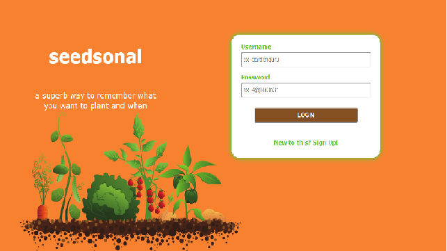

# seedsonal

an app to keep track of produce you'd like to grow by season

https://seedsonal.herokuapp.com/
  	
Demo:

UN:test
PW:thinkful



## Getting Started

These instructions will get you a copy of the project up and running on your local machine for development and testing purposes. See deployment for notes on how to deploy the project on a live system.

### Prerequisites


```
https://nodejs.org/en/
https://www.mongodb.com/
create an mLab account
create a Heroku account 

```

### Installing

A step by step series of examples that tell you how to get a development env running


```
git clone https://github.com/Laurn17/seedsonal-capstone

cd seedsonal-capstone

npm install


```

Heroku is required for deploying the app, here are the steps to install, create, and deploy to heroku:
```
npm install -g heroku

heroku create


```


## Running the tests

```
npm test
```


## Deployment
```
git push heroku master

heroku ps:scale web=1
```

## Built With

* [express](https://expressjs.com/) - The JS framework used
* [mongoose](https://mongoosejs.com/) - The database client
* [passport](http://www.passportjs.org/) -Authentication middleware
* [jquery](https://jquery.com/) - JS library
* [mocha](https://mochajs.org/) - JS testing framework


## Authors

* **Lauren Morrow** - *Initial work* - [Laurn17](https://github.com/Laurn17)
* **Matthew Prestifilippo** - *Help, Edits* - [MJPUSER](https://github.com/mjpuser)


## License

This project is licensed under the MIT License - see the [LICENSE.md](LICENSE.md) file for details

